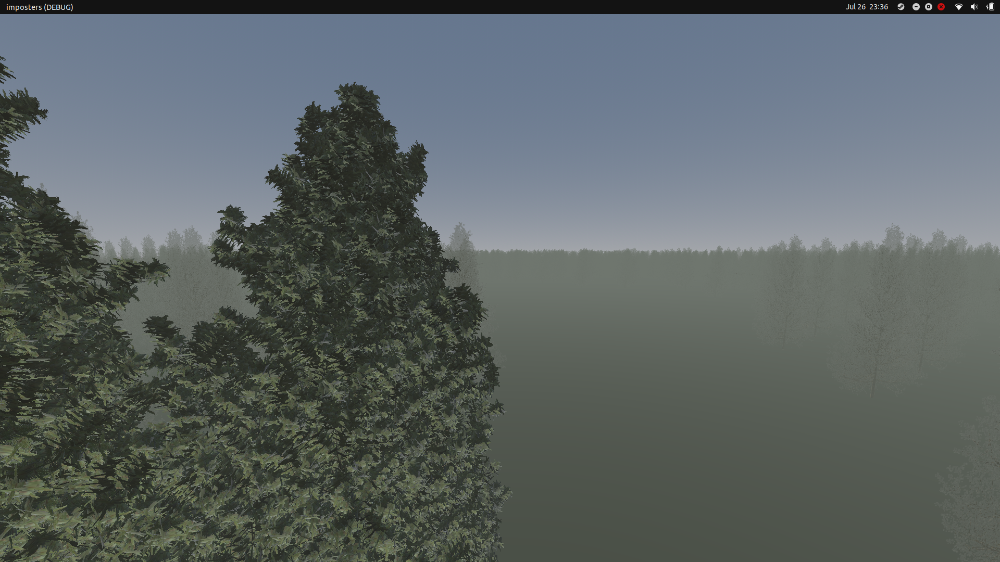

# imposters
godot gdscript imposter nodes (experimental)

- ImposterGenerator - automatically renders textures from 3d models
- Imposters - manages spawning Imposter nodes automatically using a generator
- Imposter - Sprite3D replacement for hirez models

Renders a scene to textures and switches between them based on camera position
So far, tested using 0.5B triangles in under 400 triangles for 1600+ trees

Still has bugs, but its working pretty well so far and looks great
